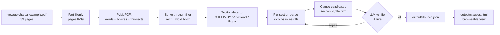

# Architecture

A deterministic PDF parser augmented by an LLM verifier. The parser owns text fidelity; the LLM owns judgment on edge cases.

## Why this split

The PDF is a legal contract — *every word* in `text` must be a word that appeared on the page (no paraphrase, no smoothing). Sending pages to a multimodal LLM and trusting it to transcribe risks silent rewrites. Conversely, hand-coded rules for "is this clause boundary correct?" become brittle once the document has multiple numbering schemes (it does — see below).

So: **PyMuPDF builds the structure deterministically, the LLM only adjudicates ambiguous boundaries.**

<figure>

<figcaption>End-to-end flow. Solid arrows are deterministic; the diamond is the only LLM step.</figcaption>
</figure>

## Pipeline stages

<section id="strike-removal">

### Strike-through removal

The source PDF encodes strike-through as **thin filled rectangles** (`re` operators, height ≈ 0.42pt) drawn over text — not as PDF annotations and not as a font flag. PyMuPDF's `page.get_drawings()` exposes them; a word is "struck" when a strike rect overlaps its bbox vertically (within the bbox's y-range) and horizontally.

Confirmed empirically: 11 strike rectangles on the *Cleanliness of tanks* page identified all 125 struck words. Word-level filtering is sufficient — every observed strike rect spans full words.

</section>
<section id="sections">

### Section detection

Part II is **not a single numbering range**. It is three concatenated documents:

| Section | Pages (1-idx) | Numbering | Layout |
|---|---|---|---|
| SHELLVOY 5 standard clauses | 6–17 | `1..44` | two-column: title left margin, body right |
| Shell Additional Clauses (Feb 1999) | 18–34 | `1..43` (resets) | single column: `N.` + title inline |
| Essar Rider Clauses (Dec 2006) | 35–39 | `1..~22` (resets) | single column: `N.` + title inline |

So `id="1"` appears **three times** in Part II. The output schema disambiguates with prefixed ids (`shellvoy-1`, `additional-1`, `essar-1`) while preserving the original numeral and section as separate model fields internally.

</section>
<section id="llm-verifier">

### LLM verifier (Azure)

The verifier receives the deterministic clause candidates as **HTML-tagged structured input** (`<clause id=...><title>...</title><text>...</text></clause>`). It does not regenerate text — it flags suspicious boundaries (truncated, merged, out-of-order) and may suggest a one-line repair.

Why HTML-tagged input?

LLMs are well-trained on HTML and use tag scaffolding as hierarchy cues; structured input outperforms plain concatenation for this kind of judgment task. The same principle drives the markdown-source / HTML-render split for the docs themselves.

Models live behind the `llm` package and are configured via `.env`:

| Role | Default deployment | Endpoint |
|---|---|---|
| Verifier | `DeepSeek-V4-Flash` | Azure Foundry |

Switch deployments by editing `MARCURA_VERIFIER_MODEL` in `.env`; deployments whose names start with `deepseek`, `grok`, `mistral`, `llama`, or `cohere` are routed through Foundry, the rest through Azure OpenAI. Reasoning effort is per-provider (`MARCURA_AZURE_OPENAI_REASONING_EFFORT`, `MARCURA_AZURE_FOUNDRY_REASONING_EFFORT`). The verifier step is cheap (~10k input tokens for the whole Part II) and skippable via a feature flag.

</section>
<section id="eval">

### Evaluation

Deterministic, no LLM. `make eval` compares parser output against a hand-curated `eval/golden.json` covering ~10 clauses spanning all three sections. Assertions:

1. Clause **count per section** matches the expected ordinals exactly (38 / 37 / 21 in this corpus).
2. **Order is monotonically increasing** within each section.
3. **Known struck snippets** (e.g. `"Has tanks coated as follows"`) do not appear in any `text`.
4. **Known surviving snippets** (e.g. the bold replacement of clause 2) do appear.
5. Titles match exactly for the golden subset, including frozen expectations on regression-prone clauses (`shellvoy-22 Ice` after the title-leakage fix; `essar-22 BILL OF LADING FIGURES` after the split-anchor fix).
6. **No embedded next-anchor leakage** — the body of clause N must not contain a fragment that looks like clause N+1's anchor.

</section>

## Output

- `output/clauses.json` — the deliverable per the task spec. Schema: `[ {id, title, text}, ... ]`, preserving document order.
- `output/clauses.html` — the same data rendered as a browseable view (Jinja2 → static HTML). Same dual-format pattern as the docs.
